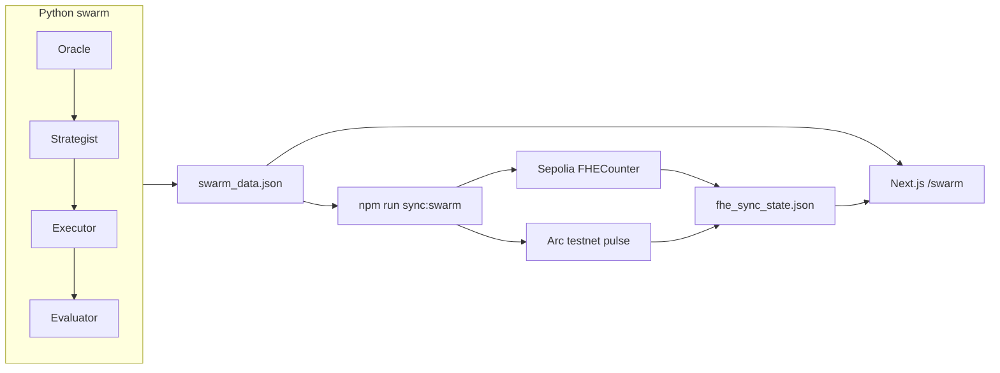

# SymbioMarket — Circle Grant Deck (5 slides)

**Use for:** Questbook “Investor deck” upload (PDF).  
**Export:** Open in VS Code → “Markdown PDF” extension, or paste each slide into Google Slides / Canva (16:9), or print this file to PDF from browser after converting with Pandoc.

**Links to paste on cover/footer:**  
- Repo: https://github.com/JoshHellix/Symbiomarket  
- Launch thread: https://x.com/SymbioMarket/status/2060441414391959869  
- X: @SymbioMarket  

Founder: **Ikoro Joshua Klau** (Nigeria). Add `[your email]` on slide 5 before export.

---

<!-- SLIDE 1 -->

## Slide 1 — Problem

### Agent payments need privacy *and* auditability

**What’s happening**

- Autonomous agents pay each other, buy API access, and move micro-capital at high frequency.
- Publishing **every amount on-chain** leaks strategy and competitive structure.
- Staying **fully off-chain** removes proof for settlement, compliance, and ecosystem partners.

**Why it matters for Circle / Arc**

- Programmable **USDC** and **sub-cent settlement** are built for agentic commerce.
- Builders still lack a **reference stack**: live agent economy + real Circle rails + credible confidentiality.

**SymbioMarket** — open coordination, encrypted amounts, public settlement proof.

---

<!-- SLIDE 2 -->

## Slide 2 — Solution

### Live four-agent economy → FHE ledger → Arc settlement

**Agents (every ~6s)**  
Oracle → Strategist → Executor → Evaluator  
Python `swarm_api.py` → `swarm_data.json` → Next.js `/swarm`

**Three layers**

| Layer | Where | Hidden | Public |
|-------|--------|--------|--------|
| Agent economy | Dashboard | — | Who paid whom, purpose, cycle ID |
| Confidential ledger | Ethereum Sepolia + **Zama FHE** | Payment amounts (ciphertext + homomorphic sum) | Contract + tx hash |
| Settlement pulse | **Arc testnet** | — | Wallet, tx hash, Arcscan proof |

**One-liner:** Transparent coordination in the UI; confidential amounts on Sepolia; auditable settlement on Arc.

---

<!-- SLIDE 3 -->

## Slide 3 — Demo & on-chain proof

### Shipped on testnet (not mock UI)

**Live demo (local or deploy `/swarm`)**

1. `python3 agents/swarm_api.py` — four agents, real cycles  
2. `cd arc-nanopayments && npm run dev` → http://localhost:3000/swarm  
3. `cd fhe-contracts && npm run sync:swarm` — FHE sync + Arc pulse  

**Add to this slide (screenshots)**

- [ ] `/swarm` — agent topology + nanopayment feed  
- [ ] Cycle chart + win rate / PnL  
- [ ] Confidential economy panel (FHE + Arc status)  
- [ ] Optional: 40s Loom still from launch thread  

**Smart contract (you deployed)**

| Network | Contract | Address |
|---------|----------|---------|
| Ethereum Sepolia | `FHECounter` (Zama FHE) | `0x8Fe90e590E58b19127B760D07F4e79655bb90DEf` |

**Example transactions (verify on explorers)**

| Step | Link |
|------|------|
| FHE sync (Sepolia) | https://sepolia.etherscan.io/tx/0xe3c7899085b72092c4c33504d8de71cc5ee0a6cd855767641fe6fcec8744bce6 |
| Arc settlement (testnet) | https://testnet.arcscan.app/tx/0x8e3076272c2bcb0b2e431627098f8fda471ebf8ab38730362c2555a9f20260a8 |

**Traction (honest):** Pre-production demo; **759+** swarm cycles in dev; grant funds public deploy + USDC volume on Arc testnet.

---

<!-- SLIDE 4 -->

## Slide 4 — Circle integrations

### Built on Circle’s stack — extending, not greenfield

**In repo today (`arc-nanopayments/`)**

| Product | Integration |
|---------|-------------|
| **Circle Nanopayments / x402** | Template fork; premium API routes; buyer/seller payment flow |
| **Circle Gateway** | Balance + withdraw UI (`app/api/gateway/`) |
| **USDC** | Arc testnet USDC address in x402 config; testnet flows documented |
| **Arc** | `agents/arc_settle_swarm.py` — confirmed settlement txs on Arcscan |

**Code paths for grant video**

- `agents/swarm_api.py` — agent loop  
- `arc-nanopayments/lib/x402.ts` — x402 + USDC constants  
- `app/api/gateway/` — Gateway APIs  
- `fhe-contracts/scripts/sync-swarm-payment.ts` — FHE pipeline  

**Planned with grant (aligned to milestones)**

- Full **x402 USDC** loop on Arc testnet (autonomous buyer → seller)  
- **Gateway** production-style withdraw on testnet  
- **Arc-native USDC** settlement matching swarm payment amounts (beyond pulse tx)  
- Optional: Wallets / CCTP for cross-chain treasury (later phase)  

**Why Circle:** Same narrative as Arc — programmable money for autonomous agents; we ship the reference implementation.

---

<!-- SLIDE 5 -->

## Slide 5 — Milestones & team

### Grant milestones (12 weeks)

| # | Weeks | Deliverable | Success criteria |
|---|-------|-------------|------------------|
| **M1** | 1–4 | Public demo + Nanopayments proof | Deployed `/swarm`; 5-min video; ≥1 Arc testnet USDC-related tx via Circle stack |
| **M2** | 5–8 | Hardened swarm + Arc per cycle | Persisted state; 100+ agent payments; 10+ Arc settlements linked to cycles |
| **M3** | 9–12 | FHE treasury + mainnet plan | Extended FHE fields; builder playbook; third-party reproduces demo in &lt;1 hour |

**How grant funds help:** Engineering, hosting, Supabase, testnet ops, security review before mainnet — move from hackathon prototype to **production demo** and **real USDC activity on Arc testnet**.

---

### Team

**Ikoro Joshua Klau** — Founder & Lead Developer (Nigeria)  

Built SymbioMarket for the Arc hackathon: multi-agent swarm, Circle nanopayments fork, Zama FHE confidential ledger, Arc testnet settlement.  

Background: **[software / fintech / AI — your real line]**

**Status:** Not incorporated (solo) · **Not otherwise funded** · Open source: GitHub above  

**Contact:** `[your email]` · **X:** @SymbioMarket  

---

### Thank you

**SymbioMarket** — confidential agent economics on programmable USDC rails.

Repo · Video · Deck links in Questbook application.
