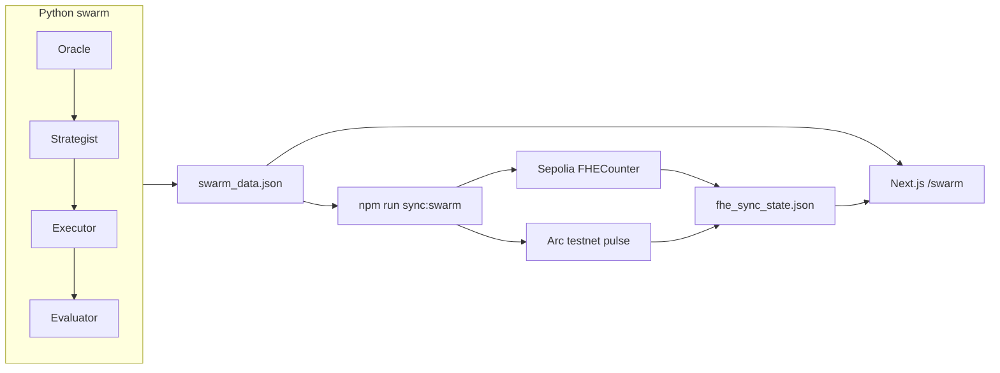

# SymbioMarket — Grant one-pager

**Tagline:** Multi-agent economic swarm with **confidential bookkeeping (Zama FHE)** and **public settlement on Arc testnet**.

**Audience:** Circle / Arc ecosystem grants, Zama FHE track, hackathon judges.

---

## Problem

Autonomous agent economies generate high-frequency micro-payments and strategy signals. Publishing every amount on-chain leaks competitive structure. Publishing nothing removes auditability for settlement layers.

## Solution

SymbioMarket splits the story into two layers:

| Layer | Chain | What is hidden | What is public |
|-------|--------|----------------|----------------|
| **Agent economy** | Live simulation + dashboard | — | Who paid whom, purpose labels, cycle id |
| **Confidential ledger** | Ethereum Sepolia + Zama FHE | Per-payment amounts in ciphertext; homomorphic sum | Contract address, tx hash, decrypt only for ledger owner |
| **Settlement pulse** | Arc testnet | — | Wallet, tx hash, Arcscan proof of live settlement |

Agents still *behave* transparently in the UI; **aggregate payment amounts** are encrypted on Sepolia before a **public Arc pulse** anchors that a settlement step occurred.

---

## What is built (demo-ready)

1. **Python swarm** (`agents/swarm_api.py`) — Oracle → Strategist → Executor → Evaluator; writes `swarm_data.json` every ~6s.
2. **Next.js dashboard** (`arc-nanopayments`) — `/swarm` (no login) or `/dashboard` with Supabase for Circle x402 nanopayments.
3. **FHE ledger** (`fhe-contracts/FHECounter.sol`) — deployed on Sepolia; `npm run sync:swarm` encrypts latest swarm payment and increments homomorphic counter.
4. **Arc settlement** (`agents/arc_settle_swarm.py`) — testnet tx after FHE sync; dashboard shows `confirmed` + Arcscan link.

### Proof points (fill in your latest hashes)

| Item | Value |
|------|--------|
| FHE contract (Sepolia) | `0x8Fe90e590E58b19127B760D07F4e79655bb90DEf` |
| Example FHE sync tx | `0x023f5d1bef03d92b997b3e776a581a9853687ffd8a54f7ed9c2f36b26389522d` |
| Example Arc settlement tx | `0xc17a1b25a1e30fbe957e095f18b8070597dce663564b483702a9c0ce444931af` |
| Arc explorer | https://testnet.arcscan.app |
| Wallet (demo) | Your deployer wallet (not stored in repo) |

---

## Architecture (30-second version)

---

## 2-minute demo script

See **`docs/DEMO_SCRIPT.md`** for step-by-step terminal commands and what to say on camera.

**Elevator pitch (read aloud):**

> SymbioMarket is a live multi-agent economy. Each cycle, agents simulate micro-payments. We encrypt the payment amount into a Zama FHE counter on Sepolia so competitors cannot read the running total from chain data alone. Then we fire a public settlement pulse on Arc testnet so auditors see real on-chain activity tied to the same cycle — confidential strategy, public settlement.

---

## Why Circle / Arc

- Built on **Circle’s arc-nanopayments** template (x402, Gateway, USDC).
- **Arc testnet** used for low-latency, agent-native settlement pulses (extensible to full USDC / Gateway flows).
- Natural fit for **programmable money + autonomous agents** narrative.

## Why Zama

- **FHECounter** proves encrypt → homomorphic add → decrypt workflow without exposing intermediate amounts on-chain.
- Same pipeline can later hold encrypted strategy confidence, risk buckets, or treasury totals.

---

## Run locally (cheat sheet)

| Terminal | Shell | Command |
|----------|-------|---------|
| 1 Swarm | WSL | `cd /mnt/c/Users/dell/cursor-symbio/Symbiomarket && source venv/bin/activate && python3 agents/swarm_api.py` |
| 2 UI | any | `cd arc-nanopayments && npm run dev` → http://localhost:3000/swarm |
| 3 FHE+Arc | **PowerShell** | `cd fhe-contracts && npm run sync:swarm` |

**Env (repo root `.env`, gitignored):** `ARC_RPC`, `ARC_READ_RPC` (public RPC for receipts), `PRIVATE_KEY`, `WALLET_ADDRESS`.  
**Env (`fhe-contracts/.env`):** `FHE_PRIVATE_KEY`, `FHEVM_SEPOLIA_RPC_URL`, `FHE_COUNTER_ADDRESS`.

**Note:** Canteen/swarm `ARC_RPC` may not return tx receipts — use `ARC_READ_RPC=https://rpc.testnet.arc.network` for polling (see `agents/arc_poll_tx.py`).

---

## Roadmap (post-grant)

| Priority | Item |
|----------|------|
| P1 | Record Loom demo using `DEMO_SCRIPT.md` |
| P2 | Deploy `/swarm` to Vercel; persist `swarm_data` / `fhe_sync_state` via API or Supabase |
| P3 | Wire **real Circle x402 USDC** on Arc (buyer/seller `.env.local`) |
| P4 | Replace self-transfer pulse with USDC transfer / Gateway withdraw |
| P5 | Encrypt additional fields (strategy score, treasury) in FHE contract |

---

## Links

- Repo layout: `docs/STEP_BY_STEP_ROADMAP.md`
- Phase 2 ops: `docs/PHASE_2.md`
- FHE contracts: `fhe-contracts/README.md`
- Circle app: `arc-nanopayments/README.md`
